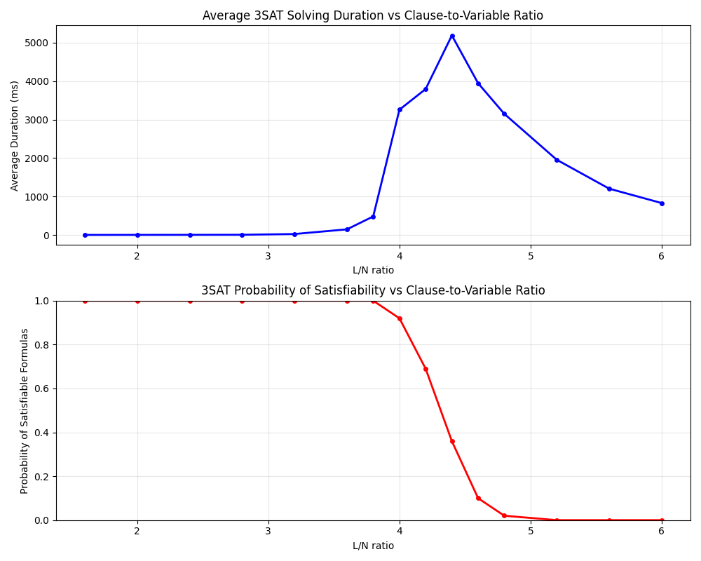

# SAT solver

This is a Rust-based SAT solver using CDCL (conflict-driven clause learning).

## Usage

```bash
cargo run -- --solver dpll --output-dir out examples/example2.cnf
```

```bash
RUST_LOG=info cargo run -- --solver cdcl --output-dir out examples/example3.cnf
```

Run on all of an open SATLIB dataset:
```bash
mkdir examples/aim
wget -qO- https://www.cs.ubc.ca/~hoos/SATLIB/Benchmarks/SAT/DIMACS/AIM/aim.tar.gz | tar xvf - -C examples/aim
cargo run examples/aim/*
```

Run 20 random 3CNF-SAT instances with 40 variables and 160 clauses:
```bash
cargo run --bin random -- -n 40 -k 3 -l 160 -r 20
```

Recreate a finding about random SAT formulas:
```bash
cargo run --bin random -- \
    -r 100 \
    -n 100 \
    -k 3 \
    -l 160 200 240 280 320 360 380 400 420 440 460 480 520 560 600 \
    >> sat.jsonl
uv run scripts/viz.py sat.jsonl
```


Get a simple DRAT proof of unsatisfiability:
```bash
cargo run -- --solver cdcl --output-dir out examples/example4.cnf
```
